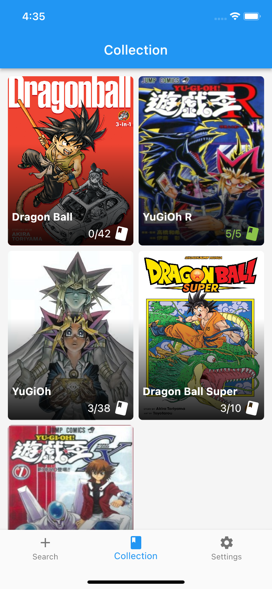
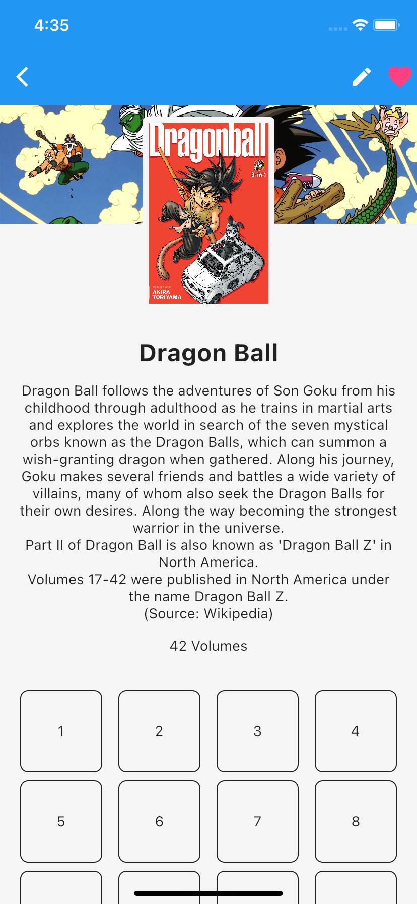
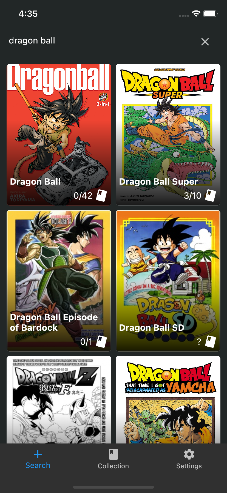
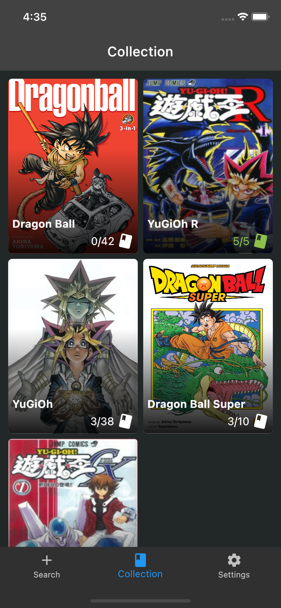
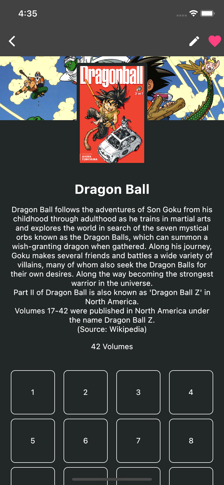

<p align="center">
    
</p>
<p align="center" style="text-align:center"><b>My Manga Collection</b></p>

---

[](https://github.com/TesteurManiak/my-manga-collection/actions/workflows/tests.yml)

Follow and track your manga collection easily with a simple Flutter application using [Kitsu API](https://kitsu.docs.apiary.io/#).

You can browse manga throught those available on Kistu API and save them thanks to a database to keep track of them. Most features are available on mobile (Android & iOS), web and desktop (Windows, Linux & MacOS).

## :sparkles: Features

| Feature | Android | iOS | Web | Windows | Linux | MacOS |
| :--- | :---: | :---: | :---: | :---: | :---: | :---: |
| Light & Dark Theme | ✅ | ✅ | ✅ | ✅ | ✅ | ✅ |
| English & French Language | ✅ | ✅ | ✅ | ✅ | ✅ | ✅ |
| Browse manga by titles throught Kitsu API | ✅ | ✅ | ✅ | ✅ | ✅ | ✅ |
| Save manga to your collection | ✅ | ✅ | ✅ | ✅ | ✅ | ✅ |
| Edit titles and the number of chapters of your mangas | ✅ | ✅ | ✅ | ✅ | ✅ | ✅ |
| Export your collection to a JSON file | ✅ | ✅ | ❌️ | ❌️ | ❌️ | ❌️ |
| Import your collection from a JSON file | ✅ | ✅ | ✅ | ✅ (not tested) | ✅ (not tested) | ✅ |

## :computer: Screenshots

### :sunny: Light

<p float="left">
    
    
    
    
</p>

### :crescent_moon: Dark

<p float="left">
    
    
    
    
</p>

## TODO

* Edit more manga information (synopsys, cover image, poster image)
* Add a manga locally if not found by the api
* Improve theming & animations

## Install

### :phone: Android

_Section in construction_

### :iphone: iOS

You need to build the application with flutter using:
```
flutter build ios
```

You need to have a MacOS machine with Xcode and Flutter installed.

## :question: How to Use

Simply browse the manga available on the API and add them to your collection. You will be able to keep track of the volume in your collection easily.

## :package: Dependencies

* [cached_network_image](https://pub.dev/packages/cached_network_image)
* [collection](https://pub.dev/packages/collection)
* [connectivity_plus](https://pub.dev/packages/connectivity_plus)
* [dio](https://pub.dev/packages/dio)
* [dynamic_theme](https://github.com/TesteurManiak/dynamic_theme)
* [easy_localization](https://pub.dev/packages/easy_localization)
* [equatable](https://pub.dev/packages/equatable)
* [file_picker](https://pub.dev/packages/file_picker)
* [flutter_riverpod](https://pub.dev/packages/flutter_riverpod)
* [go_router](https://pub.dev/packages/go_router)
* [hive](https://pub.dev/packages/hive)
* [like_button](https://pub.dev/packages/like_button)
* [rxdart](https://pub.dev/packages/rxdart)
* [shared_preferences](https://pub.dev/packages/shared_preferences)

## Credits

* [Kitsu Api](https://kitsu.docs.apiary.io/#) - For the API
* [Manga Rock](https://mangarock.com/) - For the design inspiration
